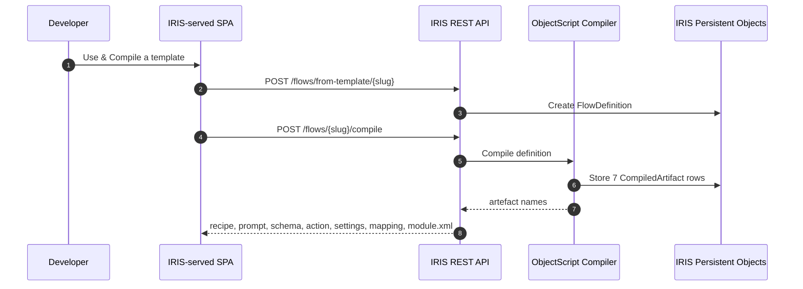
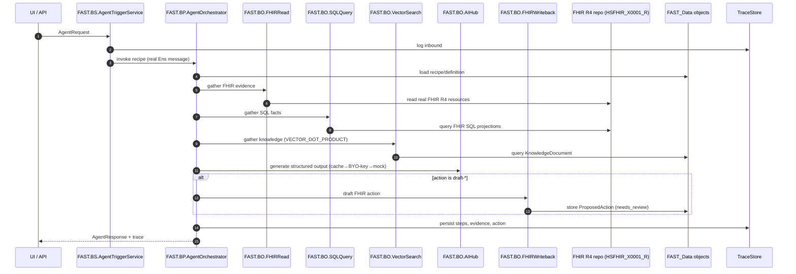
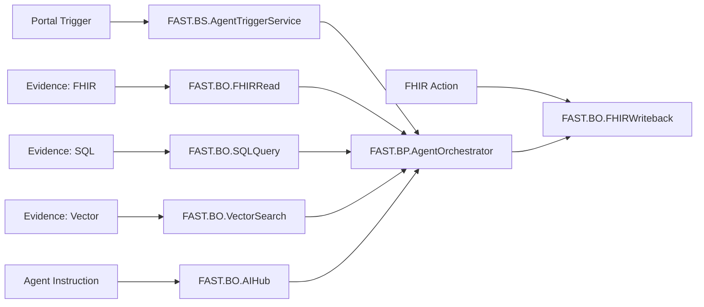

# Diagrams

## Compile & deploy

```mermaid
sequenceDiagram
    autonumber
    participant DEV as Developer
    participant SPA as IRIS-served SPA
    participant API as IRIS REST API
    participant COMP as ObjectScript Compiler
    participant DB as IRIS Persistent Objects

    DEV->>SPA: Use & Compile a template
    SPA->>API: POST /flows/from-template/{slug}
    API->>DB: Create FlowDefinition
    SPA->>API: POST /flows/{slug}/compile
    API->>COMP: Compile definition
    COMP->>DB: Store 7 CompiledArtifact rows
    COMP-->>API: artefact names
    API-->>SPA: recipe, prompt, schema, action, settings, mapping, module.xml
```

## Runtime execution

```mermaid
sequenceDiagram
    autonumber
    participant SRC as UI / API
    participant BS as FAST.BS.AgentTriggerService
    participant ORCH as FAST.BP.AgentOrchestrator
    participant FHIR as FAST.BO.FHIRRead
    participant SQL as FAST.BO.SQLQuery
    participant VEC as FAST.BO.VectorSearch
    participant AI as FAST.BO.AIHub
    participant WRITE as FAST.BO.FHIRWriteback
    participant FHIRDB as FHIR R4 repo (HSFHIR_X0001_R)
    participant DB as FAST_Data objects
    participant TRACE as TraceStore

    SRC->>BS: AgentRequest
    BS->>TRACE: log inbound
    BS->>ORCH: invoke recipe (real Ens message)
    ORCH->>DB: load recipe/definition
    ORCH->>FHIR: gather FHIR evidence
    FHIR->>FHIRDB: read real FHIR R4 resources
    ORCH->>SQL: gather SQL facts
    SQL->>FHIRDB: query FHIR SQL projections
    ORCH->>VEC: gather knowledge (VECTOR_DOT_PRODUCT)
    VEC->>DB: query KnowledgeDocument
    ORCH->>AI: generate structured output (cache→BYO-key→mock)
    alt action is draft-*
        ORCH->>WRITE: draft FHIR action
        WRITE->>DB: store ProposedAction (needs_review)
    end
    ORCH->>TRACE: persist steps, evidence, action
    ORCH-->>SRC: AgentResponse + trace
```

## Portal → HealthConnect mapping

```mermaid
flowchart LR
    A[Portal Trigger] --> B[FAST.BS.AgentTriggerService]
    C[Evidence: FHIR] --> D[FAST.BO.FHIRRead]
    E[Evidence: SQL] --> F[FAST.BO.SQLQuery]
    G[Evidence: Vector] --> H[FAST.BO.VectorSearch]
    I[Agent Instruction] --> J[FAST.BO.AIHub]
    K[FHIR Action] --> L[FAST.BO.FHIRWriteback]
    B --> M[FAST.BP.AgentOrchestrator]
    D --> M
    F --> M
    H --> M
    J --> M
    M --> L
```
