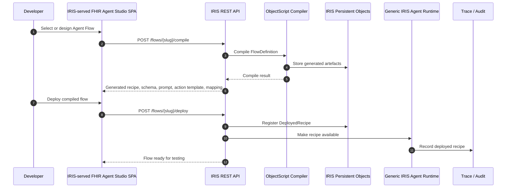
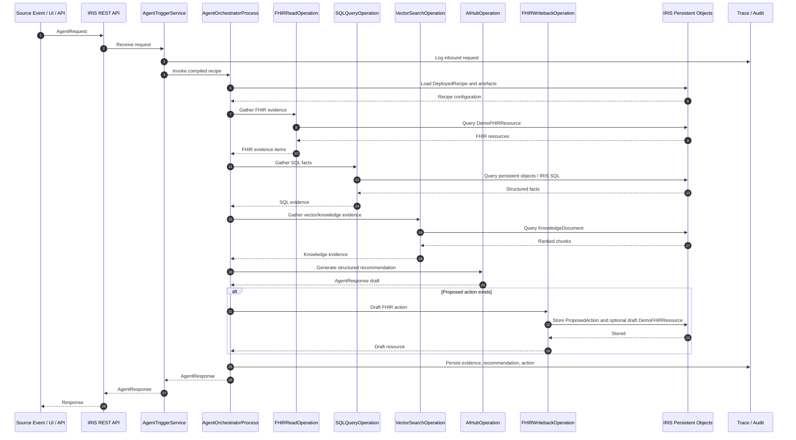
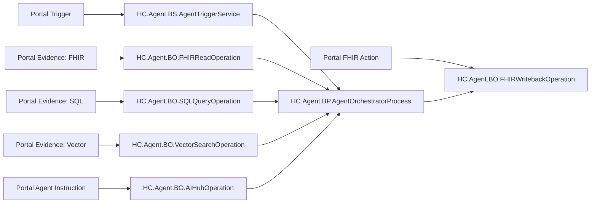

# CLI Code Agent Handoff: FHIR Agent Studio for HealthConnect

> **⚠️ Historical planning document.** This is the *original* handoff spec, kept for
> intent and milestone history. The implementation has since moved on in two ways it
> does **not** reflect: (1) the ObjectScript package and SQL schema were renamed
> `FHIRAgentStudio` → **`FAST`** / **`FAST_Data`** (every `FHIRAgentStudio.*` / file
> path below is now `FAST.*` / `iris/src/cls/FAST/...`); and (2) the runtime is no
> longer a synchronous plain-class runtime with illustrative `HC.Agent.*` labels — it
> is a **real `Ens.Production` (`FAST.Production`)** with genuine Business
> Service / Process / Operations (`FAST.BS.*`, `FAST.BP.*`, `FAST.BO.*`) and a real
> FHIR R4 repository. **For the current architecture, read [`architecture.md`](architecture.md),
> [`diagrams.md`](diagrams.md), and the repo [`README.md`](../README.md) / [`CLAUDE.md`](../CLAUDE.md).**

## Purpose of this document

This is a handoff specification for a CLI coding agent. The agent should first expand and refine the architecture, then implement the solution in code.

The solution is a contest entry for the InterSystems AI Agents + FHIR programming contest. The strategic goal is to build something that feels like a developer-facing extension to HealthConnect, while leaning as heavily as possible into **InterSystems IRIS / IRIS for Health / HealthConnect concepts**.

The final product should be a **low-code developer portal** for designing AI-agent interoperability flows, plus a **compiler** that emits HealthConnect-compatible runtime artefacts, plus a **small generic HealthConnect-style runtime** that executes the compiled flows.

The backend must be implemented in **IRIS ObjectScript** unless there is a compelling reason not to. The frontend must be a **React + TypeScript SPA using shadcn/ui**, developed with Vite and served by IRIS in the final runtime.

Working title:

> **FHIR Agent Studio: an IRIS-native developer portal that compiles AI-agent workflows into HealthConnect-compatible runtime recipes**

---

# 1. Instruction to the CLI code agent

You are being asked to build a complete prototype of **FHIR Agent Studio**.

Before coding, perform an architecture expansion step. Do not immediately start writing code. First produce a short implementation design that expands this handoff into concrete ObjectScript classes, REST routes, persistent storage classes, frontend pages/components, compiler outputs, runtime execution flow, and milestones. After that, proceed to implement the solution.

The implementation should be pragmatic and demo-oriented. It does not need to implement every InterSystems feature perfectly, but it must make the mapping to HealthConnect concepts obvious and credible.

The final repository should be runnable locally with Docker Compose, include seeded demo templates for the twelve suggested contest workflows, include at least three polished end-to-end demo flows, and expose a developer portal where users can design, compile, deploy, test, import/export, and inspect generated artefacts.

Important implementation principle:

> **Use IRIS for the backend, storage, REST API, runtime, and serving the SPA. Use ObjectScript unless something truly requires another language. Use TypeScript for the frontend. Avoid Python unless absolutely necessary.**

---

# 2. Product concept

## 2.1 One-line pitch

**FHIR Agent Studio is an IRIS-native low-code developer portal for designing AI-agent interoperability workflows. Developers model workflows using healthcare concepts — trigger, evidence, agent instruction, structured output, and FHIR action — then compile them into HealthConnect-compatible recipes, schemas, prompts, action templates, and runtime configuration stored in IRIS and executed by a generic IRIS runtime.**

## 2.2 Core product narrative

HealthConnect is an interoperability engine. It routes, transforms, monitors, and manages healthcare messages. FHIR Agent Studio adds a developer experience for creating AI-agent workflows that can be executed as part of those interoperability flows.

The project should not feel like a standalone chatbot. It should feel like a **design and compilation layer above HealthConnect-style interoperability concepts**, implemented on IRIS.

The core abstraction is:

```text
Trigger → Evidence → Agent → Action → Trace
```

Or, in the business language of the demo:

```text
When this happens,
gather this FHIR/SQL/vector evidence,
ask the agent this structured question,
produce this recommendation,
draft this FHIR action,
and trace everything.
```

## 2.3 Key differentiator

Most contest entries may build one AI agent for one workflow. This solution builds an **IRIS-native developer portal and compiler** for creating many FHIR agent workflows.

The submission should ship with all twelve suggested contest workflows as database-backed templates, but the real product is the reusable design/compile/runtime model.

---

# 3. Architecture changes and hard constraints

The following constraints are mandatory.

## 3.1 Backend must be IRIS

The backend must be implemented as an **IRIS REST application**, using ObjectScript classes.

Expected shape:

```text
IRIS / IRIS for Health container
  - ObjectScript REST API
  - persistent storage classes
  - compiler services
  - runtime services
  - seed/import/export services
  - static web application hosting
```

Do not use FastAPI, Express, Django, Flask, or any separate backend service.

## 3.2 Frontend must be served by IRIS

The frontend should be built as a React + TypeScript SPA using Vite during development. In the final Docker/runtime configuration, the built SPA assets should be served by IRIS as a web application.

Development mode can support Vite dev server if helpful, but the primary deliverable should be:

```text
IRIS REST API + IRIS-served SPA
```

## 3.3 All storage must use IRIS persistent objects

Do not use SQLite, Postgres, MongoDB, JSON files as runtime storage, or a separate persistence service.

All durable application state must be stored using IRIS persistent classes.

This includes:

- templates;
- user-created flows;
- compiled artefacts;
- deployed recipes;
- invocation traces;
- evidence items;
- generated responses;
- proposed FHIR actions;
- demo FHIR-like resources;
- knowledge/vector documents;
- import/export metadata.

Seed files may exist in the repository for initial import, but after import the source of truth is IRIS persistence. All assets should be able to be exported and then imported.

## 3.4 Frontend must use shadcn/ui

The portal frontend must use:

- React;
- TypeScript;
- Vite during development;
- shadcn/ui components;
- Tailwind CSS.

## 3.5 Portal layout requirement

The UI must be designed as a classic portal layout:

```text
┌──────────────────────────────────────────────────────────────┐
│ Fixed top header bar                                          │
│ Product name, environment labels, status, top-level actions   │
├───────────────┬──────────────────────────────────────────────┤
│ Fixed left    │ Scrollable main content area                  │
│ navigation    │                                              │
│ menu          │                                              │
│               │                                              │
└───────────────┴──────────────────────────────────────────────┘
```

The entire page must not scroll. The top header and left navigation must remain in view. Only the main content area should scroll.

## 3.6 ObjectScript-first rule

Use ObjectScript for backend logic whenever possible.

General rule:

```text
If it can reasonably be written in ObjectScript, write it in ObjectScript.
If it is frontend/UI logic, write it in TypeScript.
Avoid Python unless absolutely necessary.
```

Do not include a Python runtime by default.

Potential exceptions:

- optional future embedding/LLM adapter;
- optional external model integration;
- one-off developer tooling, not required at runtime.

For this prototype, use deterministic ObjectScript mock AI behaviour by default.

## 3.7 Templates stored in database

Templates must be stored in IRIS persistent objects, not read directly from YAML at runtime.

The repository may include seed template files, but these should be imported into the database during setup.

The portal must include import/export functionality:

- export one template/flow as JSON;
- import a JSON template/flow;
- optionally export all templates as a bundle;
- optionally import a bundle.

---

# 4. Scope and constraints

## 4.1 Build for demo strength

Prioritise a coherent, impressive, runnable demo over deep production completeness.

The prototype should make these things obvious:

1. A developer can choose or create an agent workflow template.
2. The workflow is expressed using simple healthcare interoperability concepts.
3. The workflow compiles into artefacts that map to HealthConnect runtime concepts.
4. The compiled artefacts are stored in IRIS.
5. The generic IRIS runtime can execute a compiled workflow.
6. The runtime returns evidence, recommendation, proposed FHIR action, and trace.
7. Three hero workflows run end-to-end.
8. The other nine contest workflows exist as templates and can be compiled.
9. Templates and flows can be imported/exported.

## 4.2 Must-have hero workflows

Polish these three:

1. **Abnormal Results Follow-Up Agent**
   - Best HealthConnect-native demo.
   - Triggered by abnormal `DiagnosticReport` or simulated HL7 ORU result.
   - Checks for follow-up `Task`, `ServiceRequest`, `Appointment`, or `CarePlan`.
   - Drafts a FHIR `Task` if no follow-up exists.

2. **Prior Authorization Evidence Agent**
   - Best business-value demo.
   - Gathers `Patient`, `Coverage`, `Condition`, `MedicationRequest`, `Procedure`, `Observation`, and `DocumentReference` evidence.
   - Searches persisted payer policy snippets using a VectorSearchOperation-style interface.
   - Produces an evidence packet, missing-evidence checklist, and draft `Task` or `DocumentReference`.

3. **Natural Language to FHIR Query Agent**
   - Best developer-experience demo.
   - Converts natural language into a transparent FHIR search or SQL-like query.
   - Executes read-only against demo data persisted in IRIS.
   - Shows generated query, explanation, validation status, and result preview.

## 4.3 Include all twelve templates

The portal should include these templates as IRIS database records:

1. Smart Patient Summary
2. Prior Authorization Evidence Agent
3. Gaps in Care Finder
4. Medication Safety Assistant
5. Care Plan Navigator
6. SDOH Referral Matcher
7. Clinical Trial Matcher
8. Natural Language to FHIR Query Explorer
9. Readmission Risk Workbench
10. Conversational FHIR Triage Assistant
11. Abnormal Results Follow-Up Tracker
12. Patient-Friendly Lab Explainer

Only the three hero workflows need to be deeply polished. The other nine should be present as valid templates with plausible evidence/action configuration and compile successfully.

---

# 5. Simplified IRIS-first architecture

Use three main layers, all backend layers implemented in IRIS:

```text
┌──────────────────────────────────────────────┐
│  1. IRIS-served FHIR Agent Studio SPA         │
│     React + TypeScript + shadcn/ui            │
├──────────────────────────────────────────────┤
│  2. IRIS REST API + Compiler Services         │
│     ObjectScript REST application             │
│     ObjectScript compiler/generator           │
├──────────────────────────────────────────────┤
│  3. Generic IRIS Agent Runtime                │
│     ObjectScript execution engine over        │
│     IRIS persistence objects                  │
└──────────────────────────────────────────────┘
```

## 5.1 FHIR Agent Studio portal

A web UI where developers can:

- view the twelve template workflows;
- create/edit a workflow;
- define trigger, evidence, agent instruction, output contract, and action;
- compile a workflow;
- inspect generated artefacts;
- deploy/register a compiled recipe;
- run test cases;
- inspect runtime trace;
- import/export templates and flows.

## 5.2 IRIS compiler / generator

The compiler takes a high-level flow definition stored in IRIS and emits runtime artefacts stored in IRIS.

Input flow definition:

```json
{
  "id": "results-followup",
  "name": "Abnormal Results Follow-Up Agent",
  "trigger": {
    "type": "fhir-event",
    "resourceType": "DiagnosticReport",
    "condition": "abnormal-result"
  },
  "evidence": {
    "fhir": ["Patient", "DiagnosticReport", "Observation", "Task", "ServiceRequest", "Appointment"],
    "sql": ["abnormal_result_followup_status"],
    "vector": ["clinical_followup_guidance"]
  },
  "agent": {
    "role": "care-coordinator",
    "instruction": "Determine whether this abnormal result has documented follow-up. If no follow-up exists, recommend a safe next action.",
    "outputSchema": "evidence-recommendation-action"
  },
  "action": {
    "type": "draft-fhir-create",
    "resourceType": "Task",
    "approvalRequired": true
  }
}
```

Compiled artefacts stored as persistent objects:

```text
recipe.json
prompt.md
output-schema.json
fhir-action-template.json
production-settings.json
healthconnect-mapping.json
module.xml
```

These artefacts should be viewable in the portal and exportable as JSON/text files.

## 5.3 Generic IRIS runtime

The runtime executes compiled recipes.

It should expose REST endpoints that simulate or represent HealthConnect runtime behaviour:

- receive an `AgentRequest`;
- load a compiled recipe from IRIS persistence;
- gather FHIR evidence from persisted demo resources;
- gather SQL-like facts from ObjectScript query methods or IRIS SQL;
- gather vector/knowledge evidence from persisted knowledge documents;
- call an ObjectScript AI adapter or deterministic mock AI;
- validate structured output;
- produce proposed FHIR actions;
- persist a draft write-back when required;
- record trace steps as IRIS persistent objects.

The runtime should use HealthConnect-style terminology in code and UI:

- Business Service
- Business Process
- Business Operation
- Agent Request
- Agent Response
- FHIR Read Operation
- SQL Query Operation
- Vector Search Operation
- AI Operation
- FHIR Writeback Operation
- Trace / Audit

---

# 6. Physical stack

## 6.1 Final runtime stack

Use a streamlined IRIS-first stack:

```text
docker-compose
  iris
    - IRIS / IRIS for Health
    - ObjectScript REST API
    - ObjectScript compiler
    - ObjectScript runtime
    - persistent classes
    - seeded templates/data
    - built React SPA served by IRIS
```

There should be no separate backend service.

## 6.2 Development stack

During frontend development, Vite may run separately for hot reload:

```text
docker-compose.dev
  iris
    - REST API and persistence
  frontend-dev
    - Vite dev server proxying /api to IRIS
```

But the main deliverable should be a production-style Compose file where IRIS serves the built SPA.

## 6.3 Expected quick start

```bash
git clone <repo>
cd fhir-agent-studio
docker compose up --build
```

Then open:

```text
http://localhost:52773/fhir-agent-studio/
```

REST API base path:

```text
http://localhost:52773/fhir-agent-studio/api
```

Adjust the port/path if the implementation uses a different IRIS web server configuration, but keep a single IRIS-hosted app experience.

---

# 7. Repository structure

Implement this structure unless there is a better reason to simplify:

```text
/fhir-agent-studio
  README.md
  docker-compose.yml
  docker-compose.dev.yml
  .env.example
  module.xml

  /iris
    /src
      /cls
        FHIRAgentStudio/API/Rest.cls
        FHIRAgentStudio/API/Util.cls

        FHIRAgentStudio/Data/FlowDefinition.cls
        FHIRAgentStudio/Data/Template.cls
        FHIRAgentStudio/Data/CompiledArtifact.cls
        FHIRAgentStudio/Data/DeployedRecipe.cls
        FHIRAgentStudio/Data/AgentInvocation.cls
        FHIRAgentStudio/Data/TraceStep.cls
        FHIRAgentStudio/Data/EvidenceItem.cls
        FHIRAgentStudio/Data/ProposedAction.cls
        FHIRAgentStudio/Data/DemoFHIRResource.cls
        FHIRAgentStudio/Data/KnowledgeDocument.cls
        FHIRAgentStudio/Data/ImportExportJob.cls

        FHIRAgentStudio/Compiler/Compiler.cls
        FHIRAgentStudio/Compiler/Validator.cls
        FHIRAgentStudio/Compiler/ArtifactGenerator.cls
        FHIRAgentStudio/Compiler/MappingGenerator.cls

        FHIRAgentStudio/Runtime/Runtime.cls
        FHIRAgentStudio/Runtime/RecipeLoader.cls
        FHIRAgentStudio/Runtime/FHIRReadOperation.cls
        FHIRAgentStudio/Runtime/SQLQueryOperation.cls
        FHIRAgentStudio/Runtime/VectorSearchOperation.cls
        FHIRAgentStudio/Runtime/AIHubOperation.cls
        FHIRAgentStudio/Runtime/FHIRWritebackOperation.cls
        FHIRAgentStudio/Runtime/TraceStore.cls

        FHIRAgentStudio/Seed/SeedLoader.cls
        FHIRAgentStudio/ImportExport/TemplateExporter.cls
        FHIRAgentStudio/ImportExport/TemplateImporter.cls
        FHIRAgentStudio/Util/JSON.cls
        FHIRAgentStudio/Util/Status.cls

    /csp
      index.html placeholder if needed

    iris.script
    Dockerfile

  /frontend
    package.json
    vite.config.ts
    tsconfig.json
    tailwind.config.js
    components.json
    /src
      main.tsx
      App.tsx
      /api
        client.ts
      /pages
        TemplateGallery.tsx
        FlowDesigner.tsx
        CompilePreview.tsx
        TestRun.tsx
        RuntimeTrace.tsx
        HealthConnectMapping.tsx
        ImportExport.tsx
      /components
        PortalLayout.tsx
        TopHeader.tsx
        SideNav.tsx
        FlowStepper.tsx
        TriggerPanel.tsx
        EvidencePanel.tsx
        AgentPanel.tsx
        ActionPanel.tsx
        TestPanel.tsx
        ArtifactViewer.tsx
        TraceTimeline.tsx
        HealthConnectMap.tsx
        TemplateImportExport.tsx
      /components/ui
        shadcn generated components
      /types
        flow.ts
        runtime.ts
        artifact.ts
      /styles
        globals.css

  /seed
    /templates
      smart-patient-summary.json
      prior-auth.json
      gaps-in-care.json
      medication-safety.json
      care-plan-navigator.json
      sdoh-referral.json
      clinical-trial-matcher.json
      nl-to-fhir-query.json
      readmission-risk.json
      conversational-triage.json
      results-followup.json
      lab-explainer.json
    /demo-data
      fhir-resources.json
      knowledge-documents.json

  /docs
    architecture.md
    diagrams.md
    demo-script.md
```

Notes:

- Seed files are allowed, but runtime storage must be IRIS persistent objects.
- The `/frontend/dist` build output should be copied into IRIS web application static serving during Docker build or container startup.
- Do not store templates as YAML at runtime. Use JSON seed files imported into persistent classes.

---

# 8. IRIS persistent data model

Use IRIS persistent classes for all durable state.

The exact ObjectScript syntax can be determined during implementation, but the conceptual model should be as follows.

## 8.1 `FHIRAgentStudio.Data.Template`

Stores reusable template definitions.

Fields:

```text
IdKey / Slug
Name
Category
Description
Version
DefinitionJSON
CreatedAt
UpdatedAt
IsSystemTemplate
```

## 8.2 `FHIRAgentStudio.Data.FlowDefinition`

Stores user-created or template-derived flows.

Fields:

```text
Slug
Name
Description
Version
DefinitionJSON
SourceTemplateSlug
CreatedAt
UpdatedAt
Status
```

## 8.3 `FHIRAgentStudio.Data.CompiledArtifact`

Stores compiler outputs.

Fields:

```text
FlowSlug
ArtifactName
ArtifactType
Content
ContentType
CreatedAt
Version
```

Artifact names:

```text
recipe.json
prompt.md
output-schema.json
fhir-action-template.json
production-settings.json
healthconnect-mapping.json
module.xml
```

## 8.4 `FHIRAgentStudio.Data.DeployedRecipe`

Stores deployed/registered recipe metadata.

Fields:

```text
RecipeId
FlowSlug
RecipeJSON
IsActive
DeployedAt
Version
```

## 8.5 `FHIRAgentStudio.Data.AgentInvocation`

Stores runtime invocation result.

Fields:

```text
RequestId
RecipeId
FlowSlug
TriggerType
PatientId
ContextJSON
Status
Summary
ResponseJSON
TraceId
StartedAt
CompletedAt
```

## 8.6 `FHIRAgentStudio.Data.TraceStep`

Stores runtime trace steps.

Fields:

```text
TraceId
StepNumber
ComponentType
ComponentName
Status
Detail
PayloadJSON
StartedAt
CompletedAt
DurationMs
```

## 8.7 `FHIRAgentStudio.Data.EvidenceItem`

Stores evidence items produced during a run.

Fields:

```text
InvocationId
EvidenceId
EvidenceType
Source
Display
Relevance
PayloadJSON
```

## 8.8 `FHIRAgentStudio.Data.ProposedAction`

Stores proposed FHIR actions.

Fields:

```text
InvocationId
ActionType
ResourceType
RequiresApproval
Status
ResourceJSON
CreatedAt
```

## 8.9 `FHIRAgentStudio.Data.DemoFHIRResource`

Stores demo FHIR resources.

Fields:

```text
ResourceType
ResourceId
PatientRef
ResourceJSON
Tags
CreatedAt
UpdatedAt
```

## 8.10 `FHIRAgentStudio.Data.KnowledgeDocument`

Stores knowledge/vector-like documents.

Fields:

```text
Collection
DocumentId
Title
ChunkText
MetadataJSON
Keywords
CreatedAt
```

For the prototype, `VectorSearchOperation` can use keyword/term matching over persisted documents. If true IRIS vector search is available, implement or stub the class so it can be upgraded later.

## 8.11 `FHIRAgentStudio.Data.ImportExportJob`

Stores import/export events.

Fields:

```text
JobType
EntityType
EntitySlug
Status
Message
PayloadJSON
CreatedAt
```

---

# 9. Backend REST API requirements

Implement the backend as an IRIS REST application.

Suggested REST dispatch class:

```text
FHIRAgentStudio.API.Rest
```

Suggested base path:

```text
/fhir-agent-studio/api
```

All endpoints should return JSON.

## 9.1 Templates

```http
GET    /api/templates
GET    /api/templates/{slug}
POST   /api/templates/import
GET    /api/templates/{slug}/export
GET    /api/templates/export-all
```

Returns available flow templates from IRIS persistence.

Import/export format should be JSON.

## 9.2 Flows

```http
GET    /api/flows
POST   /api/flows
GET    /api/flows/{slug}
PUT    /api/flows/{slug}
DELETE /api/flows/{slug}
POST   /api/flows/from-template/{templateSlug}
POST   /api/flows/import
GET    /api/flows/{slug}/export
```

Flows are user-created or template-derived definitions.

## 9.3 Compiler

```http
POST   /api/flows/{slug}/compile
GET    /api/flows/{slug}/artifacts
GET    /api/flows/{slug}/artifacts/{artifactName}
```

Compile should generate artefacts as `CompiledArtifact` persistent objects.

Do not rely on filesystem build folders as source of truth.

## 9.4 Deploy/register

```http
POST   /api/flows/{slug}/deploy
GET    /api/runtime/recipes
```

Deploy should register the compiled `recipe.json` into `DeployedRecipe`.

## 9.5 Test/runtime

```http
POST   /api/runtime/run
POST   /api/flows/{slug}/test
GET    /api/invocations
GET    /api/invocations/{requestId}
GET    /api/traces/{traceId}
```

`POST /api/flows/{slug}/test` should run the template's configured test case.

## 9.6 HealthConnect mapping

```http
GET    /api/flows/{slug}/healthconnect-mapping
```

Returns explicit mapping from portal concepts to HealthConnect-style components.

## 9.7 Seed/admin

```http
POST   /api/admin/seed
GET    /api/admin/status
```

Useful for resetting or loading demo data.

---

# 10. Runtime operations in ObjectScript

Implement the runtime as a series of ObjectScript classes that are easy to trace.

## 10.1 `FHIRReadOperation`

Reads from `FHIRAgentStudio.Data.DemoFHIRResource`.

Input:

- patientId;
- required resource types;
- optional context resource ids.

Output:

- evidence items;
- raw resource payloads.

Required behaviour for hero workflows:

- Results follow-up: retrieve patient, diagnostic report, observations, tasks, service requests, appointments.
- Prior auth: retrieve patient, coverage, conditions, medications, procedures, observations, document references.
- NL-to-FHIR query: retrieve schema/resource metadata or demo data depending on query.

## 10.2 `SQLQueryOperation`

Use ObjectScript methods and/or IRIS SQL over persistent demo resource objects.

Implement named query functions:

```text
abnormal_result_followup_status
prior_auth_supporting_evidence
recent_labs
medication_history
overdue_screenings
diabetes_a1c_over_9_last_6_months
```

Each function returns structured facts plus evidence item references.

For the prototype, parsing FHIR JSON inside ObjectScript is acceptable. If there is time, add SQL-friendly indexed fields to `DemoFHIRResource`.

## 10.3 `VectorSearchOperation`

Use an ObjectScript implementation.

Prototype behaviour:

- query `FHIRAgentStudio.Data.KnowledgeDocument` records;
- match by collection and keyword overlap;
- rank by simple score;
- return top matching chunks.

The class and interface should be named as vector search even if the implementation is keyword-based. Leave comments/TODOs indicating where IRIS Vector Search can be wired in.

Collections:

```text
payer_policies
clinical_followup_guidance
patient_education
drug_guidance
trial_criteria
community_resources
```

## 10.4 `AIHubOperation`

Default to deterministic ObjectScript mock AI so the demo is stable.

The operation should inspect `recipeId`, evidence, and context and return plausible structured output.

Optional future model config can be present but must not be required:

```text
LLM_MODE=mock|external
LLM_ENDPOINT=
LLM_API_KEY=
LLM_MODEL=
```

Do not include Python just for LLM calls. If external calls are added, use ObjectScript HTTP client capabilities.

## 10.5 `FHIRWritebackOperation`

For demo, this creates draft resources as `ProposedAction` records and optionally as `DemoFHIRResource` records with draft status.

Supported resource types:

```text
Task
ServiceRequest
CarePlan
DocumentReference
QuestionnaireResponse
Communication
DetectedIssue
```

For actions with `approvalRequired: true`, the runtime should mark them as `draft` or `needs_review` rather than auto-committing.

---

# 11. Compiler requirements

Implement compiler services in ObjectScript.

## 11.1 Compiler responsibilities

Given a `FlowDefinition` or `Template`, the compiler should:

1. Validate the flow definition JSON.
2. Generate `recipe.json`.
3. Generate `prompt.md`.
4. Generate `output-schema.json`.
5. Generate `fhir-action-template.json`.
6. Generate `production-settings.json`.
7. Generate `healthconnect-mapping.json`.
8. Generate `module.xml`.
9. Store each artefact as a `CompiledArtifact` persistent object.

## 11.2 Compiler should not overbuild

The compiler does not need to generate complex ObjectScript classes, BPL diagrams, or DTL transformations.

The main idea is:

```text
Portal flow definition → compiled recipe/config artefacts → generic IRIS runtime executes recipe
```

## 11.3 Generated artefacts

For every compiled flow, generate these artefacts.

### `recipe.json`

Contains the executable recipe.

### `prompt.md`

Template:

```markdown
# Agent Instruction: {{name}}

Role: {{agent.role}}

Objective:
{{agent.instruction}}

Use the supplied evidence. Do not invent facts. Return output matching schema: {{agent.outputSchema}}.

Required output sections:
- Summary
- Evidence
- Recommendations
- Proposed FHIR Actions
- Safety / review status
```

### `output-schema.json`

For most flows, use the common `evidence-recommendation-action` schema.

### `fhir-action-template.json`

Example for Task:

```json
{
  "resourceType": "Task",
  "status": "draft",
  "intent": "order",
  "description": "{{recommendation.text}}",
  "for": {
    "reference": "{{patientId}}"
  },
  "authoredOn": "{{now}}"
}
```

### `production-settings.json`

Should look like HealthConnect runtime config:

```json
{
  "production": "HC.Agent.Runtime.Production",
  "businessService": "HC.Agent.BS.AgentTriggerService",
  "routerProcess": "HC.Agent.BP.AgentRouterProcess",
  "orchestratorProcess": "HC.Agent.BP.AgentOrchestratorProcess",
  "operations": {
    "fhirRead": "HC.Agent.BO.FHIRReadOperation",
    "sqlQuery": "HC.Agent.BO.SQLQueryOperation",
    "vectorSearch": "HC.Agent.BO.VectorSearchOperation",
    "ai": "HC.Agent.BO.AIHubOperation",
    "writeback": "HC.Agent.BO.FHIRWritebackOperation"
  }
}
```

### `healthconnect-mapping.json`

Explicit map from flow concepts to HealthConnect-style components.

### `module.xml`

A lightweight InterSystems Package Manager-style metadata file. It should include package name, version, dependencies if any, and artefact references.

---

# 12. Frontend requirements

The frontend should look like a developer portal, not a patient app.

## 12.1 Technology

Use:

```text
React
TypeScript
Vite
shadcn/ui
Tailwind CSS
```

## 12.2 Layout

Implement a fixed portal shell:

```text
TopHeader fixed at top
SideNav fixed below header on the left
MainContent scrolls internally
Body/page itself does not scroll
```

Implementation guidance:

```text
html, body, #root: height: 100%; overflow: hidden;
Portal root: flex column, h-screen;
Header: fixed height, shrink-0;
Below header: flex row, min-h-0;
SideNav: fixed width, shrink-0, overflow-y-auto if needed;
Main: flex-1, min-w-0, overflow-y-auto;
```

## 12.3 Top header

The top header should include:

- product name: FHIR Agent Studio;
- environment/status badge: IRIS Runtime Connected;
- current selected flow/template if applicable;
- buttons/menus for Import, Export, Seed/Reset, GitHub/Docs if useful;
- compact visual branding that feels like a developer portal.

## 12.4 Left navigation

Suggested menu:

```text
Templates
Flows
Designer
Compile Preview
Test Run
Runtime Trace
HealthConnect Mapping
Import / Export
Admin / Seed Data
```

## 12.5 Main pages

### Template Gallery

Show the twelve templates as cards.

Each card should show:

- name;
- category;
- trigger;
- evidence sources;
- proposed action;
- buttons: `Use Template`, `Compile`, `Run Demo`, `Export`.

### Flow Designer

Use a simple stepper:

```text
Trigger → Evidence → Agent → Action → Test
```

Each panel should be editable enough for a prototype.

Trigger panel:

- trigger type;
- resource type;
- condition.

Evidence panel:

- FHIR resources multi-select;
- SQL facts multi-select;
- vector collections multi-select.

Agent panel:

- role;
- instruction;
- output schema.

Action panel:

- action type;
- FHIR resource type;
- approval required.

Test panel:

- patient id;
- context resource ids;
- run test button.

### Compile Preview

Show generated artefacts retrieved from IRIS:

- `recipe.json`
- `prompt.md`
- `output-schema.json`
- `fhir-action-template.json`
- `production-settings.json`
- `healthconnect-mapping.json`
- `module.xml`

Use a code viewer.

### Runtime Trace

Show a timeline styled like a production trace:

```text
Business Service: AgentTriggerService
Business Process: AgentOrchestratorProcess
Business Operation: FHIRReadOperation
Business Operation: SQLQueryOperation
Business Operation: VectorSearchOperation
Business Operation: AIHubOperation
Business Operation: FHIRWritebackOperation
```

For each step show:

- status;
- duration if available;
- detail;
- payload preview.

### HealthConnect Mapping

Show a diagram or structured view mapping portal concepts to HealthConnect concepts:

```text
Portal Trigger
  → HC.Agent.BS.AgentTriggerService

Portal Evidence/FHIR
  → HC.Agent.BO.FHIRReadOperation

Portal Evidence/SQL
  → HC.Agent.BO.SQLQueryOperation

Portal Evidence/Vector
  → HC.Agent.BO.VectorSearchOperation

Portal Agent Instruction
  → HC.Agent.BO.AIHubOperation

Portal FHIR Action
  → HC.Agent.BO.FHIRWritebackOperation
```

### Import / Export

Support:

- export current template;
- export current flow;
- import template JSON;
- import flow JSON;
- export all templates;
- optionally import template bundle.

This page should call IRIS REST endpoints and store imported records in IRIS persistence.

---

# 13. Template definitions

Create all twelve templates as seed JSON files, then import them into IRIS persistent storage during setup.

Each template should use this common schema:

```json
{
  "id": "string",
  "name": "string",
  "category": "string",
  "description": "string",
  "trigger": {
    "type": "string",
    "resourceType": "string|null",
    "condition": "string|null"
  },
  "evidence": {
    "fhir": ["string"],
    "sql": ["string"],
    "vector": ["string"]
  },
  "agent": {
    "role": "string",
    "instruction": "string",
    "outputSchema": "string"
  },
  "action": {
    "type": "string",
    "resourceType": "string|null",
    "approvalRequired": true
  },
  "testCase": {
    "patientId": "string|null",
    "context": {}
  }
}
```

## 13.1 Results follow-up template

```json
{
  "id": "results-followup",
  "name": "Abnormal Results Follow-Up Agent",
  "category": "Patient Safety",
  "description": "Detect abnormal results without documented follow-up and draft a FHIR Task.",
  "trigger": {
    "type": "fhir-event",
    "resourceType": "DiagnosticReport",
    "condition": "abnormal-result"
  },
  "evidence": {
    "fhir": ["Patient", "DiagnosticReport", "Observation", "Task", "ServiceRequest", "Appointment"],
    "sql": ["abnormal_result_followup_status"],
    "vector": ["clinical_followup_guidance"]
  },
  "agent": {
    "role": "care-coordinator",
    "instruction": "Determine whether this abnormal result has documented follow-up. If no follow-up exists, recommend a safe next action.",
    "outputSchema": "evidence-recommendation-action"
  },
  "action": {
    "type": "draft-fhir-create",
    "resourceType": "Task",
    "approvalRequired": true
  },
  "testCase": {
    "patientId": "Patient/pat-abnormal-001",
    "context": {
      "diagnosticReportId": "DiagnosticReport/dr-abnormal-001"
    }
  }
}
```

## 13.2 Prior auth template

```json
{
  "id": "prior-auth",
  "name": "Prior Authorization Evidence Agent",
  "category": "Administrative",
  "description": "Assemble FHIR evidence and payer policy guidance for a prior authorization request.",
  "trigger": {
    "type": "manual-or-api",
    "resourceType": "Task",
    "condition": "prior-auth-request"
  },
  "evidence": {
    "fhir": ["Patient", "Coverage", "Condition", "MedicationRequest", "Procedure", "Observation", "DocumentReference"],
    "sql": ["prior_auth_supporting_evidence", "recent_labs", "medication_history"],
    "vector": ["payer_policies"]
  },
  "agent": {
    "role": "utilization-management-nurse",
    "instruction": "Build a prior authorization evidence packet, identify supporting evidence, and list missing documentation.",
    "outputSchema": "prior-auth-packet"
  },
  "action": {
    "type": "draft-fhir-create",
    "resourceType": "DocumentReference",
    "approvalRequired": true
  },
  "testCase": {
    "patientId": "Patient/pat-prior-auth-001",
    "context": {
      "requestedService": "Semaglutide prior authorization"
    }
  }
}
```

## 13.3 NL to FHIR query template

```json
{
  "id": "nl-to-fhir-query",
  "name": "Natural Language to FHIR Query Agent",
  "category": "Developer Experience",
  "description": "Convert natural language questions into transparent read-only FHIR or SQL queries.",
  "trigger": {
    "type": "manual-or-api",
    "resourceType": null,
    "condition": "natural-language-query"
  },
  "evidence": {
    "fhir": ["Patient", "Observation", "Condition", "MedicationRequest"],
    "sql": ["diabetes_a1c_over_9_last_6_months"],
    "vector": []
  },
  "agent": {
    "role": "interoperability-developer",
    "instruction": "Convert the user's natural language question into a safe read-only FHIR search or SQL-style query. Explain the generated query.",
    "outputSchema": "nl-query-result"
  },
  "action": {
    "type": "read-only",
    "resourceType": null,
    "approvalRequired": false
  },
  "testCase": {
    "patientId": null,
    "context": {
      "question": "Show diabetic patients with HbA1c above 9 in the last 6 months"
    }
  }
}
```

Create the remaining nine using the same JSON schema.

---

# 14. Demo data requirements

Create seed JSON files that are imported into IRIS persistent objects.

## 14.1 Patient for abnormal result

Patient:

```text
Patient/pat-abnormal-001
Name: Jordan Taylor
```

Data:

- abnormal HbA1c or imaging result;
- `DiagnosticReport/dr-abnormal-001`;
- linked `Observation/obs-a1c-001` with abnormal value;
- no follow-up `Task`, `ServiceRequest`, or `Appointment`;
- enough data for the agent to recommend a follow-up task.

## 14.2 Patient for prior authorization

Patient:

```text
Patient/pat-prior-auth-001
Name: Maria Chen
```

Data:

- diabetes or obesity-related condition;
- medication history with failed therapies;
- recent lab observations;
- coverage information;
- some missing evidence to demonstrate checklist;
- payer policy knowledge document requiring criteria.

## 14.3 Data for NL-to-FHIR query

Create at least 5 demo patients:

- some with diabetes;
- some with HbA1c > 9;
- some with HbA1c <= 9;
- dates within and outside last six months.

This supports the query:

```text
Show diabetic patients with HbA1c above 9 in the last 6 months
```

---

# 15. Runtime request/response models

## 15.1 AgentRequest

```json
{
  "requestId": "req-001",
  "recipeId": "results-followup",
  "triggerType": "fhir-event",
  "patientId": "Patient/pat-abnormal-001",
  "context": {
    "diagnosticReportId": "DiagnosticReport/dr-abnormal-001"
  }
}
```

## 15.2 AgentResponse

```json
{
  "requestId": "req-001",
  "recipeId": "results-followup",
  "status": "needs_review",
  "summary": "Abnormal result appears to have no documented follow-up.",
  "evidence": [
    {
      "id": "ev-001",
      "type": "FHIR_RESOURCE",
      "source": "DiagnosticReport/dr-abnormal-001",
      "display": "Abnormal HbA1c result",
      "relevance": "Triggering abnormal result"
    }
  ],
  "recommendations": [
    {
      "priority": "urgent",
      "owner": "care-team",
      "text": "Create a follow-up task for clinician review."
    }
  ],
  "proposedActions": [
    {
      "type": "FHIR_CREATE",
      "resourceType": "Task",
      "requiresApproval": true,
      "resource": {}
    }
  ],
  "traceId": "trace-001"
}
```

## 15.3 Trace model

A trace should show each runtime step.

```json
{
  "traceId": "trace-001",
  "requestId": "req-001",
  "recipeId": "results-followup",
  "steps": [
    {
      "name": "Business Service: AgentTriggerService",
      "status": "ok",
      "detail": "Received AgentRequest"
    },
    {
      "name": "Business Process: AgentOrchestratorProcess",
      "status": "ok",
      "detail": "Loaded compiled recipe"
    },
    {
      "name": "Business Operation: FHIRReadOperation",
      "status": "ok",
      "detail": "Retrieved Patient, DiagnosticReport, Observation, Task, ServiceRequest, Appointment"
    },
    {
      "name": "Business Operation: SQLQueryOperation",
      "status": "ok",
      "detail": "Executed abnormal_result_followup_status"
    },
    {
      "name": "Business Operation: VectorSearchOperation",
      "status": "ok",
      "detail": "Retrieved clinical follow-up guidance"
    },
    {
      "name": "Business Operation: AIHubOperation",
      "status": "ok",
      "detail": "Generated structured recommendation"
    },
    {
      "name": "Business Operation: FHIRWritebackOperation",
      "status": "drafted",
      "detail": "Drafted Task requiring approval"
    }
  ]
}
```

---

# 16. Mermaid diagrams to include in docs

Create `/docs/diagrams.md` with these diagrams.

## 16.1 Developer compile-and-deploy flow



## 16.2 Runtime execution flow



## 16.3 HealthConnect mapping flow



---

# 17. README requirements

The README must be strong. Include:

1. Project title and tagline.
2. Contest-oriented summary.
3. Why this is IRIS-native and HealthConnect-aligned.
4. Architecture diagram.
5. Quick start.
6. Development workflow for React/Vite.
7. Production-style workflow where IRIS serves the SPA.
8. How to run the three hero demos.
9. How to create a new agent flow.
10. How compile works.
11. Generated artefacts explanation.
12. Twelve templates table.
13. REST API overview.
14. Persistent data model summary.
15. Import/export feature.
16. Safety and human-review model.
17. Future InterSystems integration points.

## 17.1 Quick-start target

```bash
git clone <repo>
cd fhir-agent-studio
docker compose up --build
```

Then:

```text
Portal: http://localhost:52773/fhir-agent-studio/
API:    http://localhost:52773/fhir-agent-studio/api
```

## 17.2 Demo script in README

Include:

```text
Demo 1: Compile and run Abnormal Results Follow-Up Agent
Demo 2: Compile and run Prior Authorization Evidence Agent
Demo 3: Compile and run Natural Language to FHIR Query Agent
Demo 4: Inspect generated HealthConnect mapping and artefacts
Demo 5: Export/import a template
Demo 6: Show remaining nine templates
```

---

# 18. Safety and governance requirements

The product must not imply autonomous clinical decision-making.

Use these principles:

- All clinical or administrative actions are drafted, not silently executed.
- Human approval is required for patient-impacting write-backs.
- The output must include evidence references.
- The runtime must record a trace.
- The default AI mode must be deterministic/mockable in ObjectScript.
- Patient-facing outputs should be clearly labelled as draft education or explanation.

Use labels in UI:

```text
Draft recommendation
Requires human review
Evidence-grounded
FHIR action not committed
```

---

# 19. Acceptance criteria

The implementation is acceptable when all of the following are true.

## 19.1 Build and run

- `docker compose up --build` starts IRIS.
- The IRIS REST API is available.
- The React SPA is served by IRIS.
- The portal loads at the configured IRIS web path.
- There is no required Python backend and no required non-IRIS database.

## 19.2 Templates

- The twelve templates are imported into IRIS persistent storage.
- The twelve templates appear in the Template Gallery.
- Each template can be opened.
- Each template can be compiled.
- Templates can be exported and imported as JSON.

## 19.3 Compilation

For a compiled template, the UI shows generated artefacts loaded from IRIS persistence:

- `recipe.json`
- `prompt.md`
- `output-schema.json`
- `fhir-action-template.json`
- `production-settings.json`
- `healthconnect-mapping.json`
- `module.xml`

## 19.4 Runtime

The three hero workflows can be run from the UI:

1. Results follow-up
2. Prior authorization
3. Natural-language FHIR query

Each run produces:

- `AgentResponse`;
- evidence list;
- recommendation;
- proposed action or read-only result;
- trace timeline;
- persisted invocation record in IRIS.

## 19.5 HealthConnect mapping

Each flow has a HealthConnect Mapping view showing:

- Business Service;
- Business Process;
- Business Operations;
- message/request/response artefacts;
- generated settings.

## 19.6 Documentation

The README explains the architecture and demo.

`/docs/diagrams.md` includes Mermaid diagrams.

`/docs/demo-script.md` includes a step-by-step judging demo script.

---

# 20. Implementation milestones for the CLI code agent

Follow this order.

## Milestone 1: Architecture expansion

Before writing code, produce a concise implementation design covering:

- final IRIS container/web application approach;
- ObjectScript package/class layout;
- persistent classes;
- REST dispatch routes;
- frontend pages/components;
- compile flow;
- runtime flow;
- seed/import/export plan;
- SPA build and IRIS serving approach;
- test/demo plan.

Then proceed to code.

## Milestone 2: IRIS backend skeleton

Build ObjectScript classes for:

- REST API dispatch;
- persistent models;
- JSON utilities;
- seed loader;
- admin status endpoint.

## Milestone 3: Seed templates and demo data

Create twelve JSON template seed files and enough FHIR/knowledge data for the three hero workflows. Import them into IRIS persistent objects at startup or via `/api/admin/seed`.

## Milestone 4: Compiler

Implement ObjectScript compiler that emits generated artefacts as `CompiledArtifact` records.

## Milestone 5: Runtime

Implement ObjectScript runtime operations:

- `FHIRReadOperation`;
- `SQLQueryOperation`;
- `VectorSearchOperation`;
- `AIHubOperation`;
- `FHIRWritebackOperation`;
- `TraceStore`.

## Milestone 6: Import/export

Implement JSON import/export for templates and flows.

## Milestone 7: Frontend

Build portal UI with:

- fixed header;
- fixed left nav;
- scrollable main content;
- shadcn/ui components;
- Template Gallery;
- Flow Designer;
- Compile Preview;
- Test Run;
- Runtime Trace;
- HealthConnect Mapping;
- Import/Export.

## Milestone 8: Serve SPA from IRIS

Ensure production Docker build compiles the Vite app and makes it available through IRIS as a web application.

## Milestone 9: Documentation

Write README, diagrams, and demo script.

## Milestone 10: Polish

Ensure Docker Compose works. Ensure hero demos are smooth. Ensure generated artefacts are readable. Ensure UI uses HealthConnect vocabulary. Ensure there is no accidental dependency on Python/FastAPI/SQLite.

---

# 21. Important design guidance

## 21.1 Keep the architecture simple

Do not overbuild a generic agent framework. The centre of gravity is the IRIS-native developer portal and compiler.

The runtime should be small and generic.

## 21.2 Lean into IRIS

Use IRIS for:

- REST API;
- persistence;
- runtime execution;
- demo data;
- trace storage;
- template import/export;
- serving frontend assets.

## 21.3 Make the HealthConnect mapping explicit

The portal must repeatedly show how its concepts map into HealthConnect-style concepts.

This is essential to the product story.

## 21.4 Optimise for judge comprehension

Within one minute, a judge should understand:

```text
This IRIS-served portal lets me design a FHIR AI-agent workflow.
It compiles the workflow into HealthConnect-compatible artefacts.
A generic IRIS runtime executes it and shows traceable evidence, recommendation, and FHIR action.
```

## 21.5 Default to deterministic behaviour

Do not make the demo dependent on live LLM availability. Add real LLM support only as optional.

## 21.6 Use the twelve workflows as templates, not twelve bespoke apps

This is critical. The solution wins because it is a reusable development experience.

---

# 22. Final build prompt for the CLI code agent

Use this as the operative instruction:

```text
Build FHIR Agent Studio: an IRIS-native low-code developer portal and compiler for designing AI-agent FHIR interoperability workflows that map to HealthConnect-style runtime concepts.

First, expand this specification into a concrete implementation plan. Then implement the repository.

The system must include:
- an IRIS ObjectScript REST API;
- IRIS persistent classes for all storage;
- a React + TypeScript + shadcn/ui SPA developed with Vite and served by IRIS in the final runtime;
- a fixed portal layout with top header, left navigation, and internally scrollable main content;
- twelve workflow templates stored in IRIS persistence;
- template and flow import/export as JSON;
- a flow designer based on Trigger → Evidence → Agent → Action → Test;
- an ObjectScript compiler that emits recipe.json, prompt.md, output-schema.json, fhir-action-template.json, production-settings.json, healthconnect-mapping.json, and module.xml as persistent artefacts;
- a generic ObjectScript runtime that executes compiled recipes using FHIRReadOperation, SQLQueryOperation, VectorSearchOperation, AIHubOperation, and FHIRWritebackOperation;
- three polished hero demos: Abnormal Results Follow-Up, Prior Authorization Evidence, and Natural Language to FHIR Query;
- trace/audit views styled around HealthConnect Business Service, Business Process, and Business Operation concepts;
- Docker Compose quick start;
- complete README, diagrams, and demo script.

Keep the runtime simple and deterministic by default. Do not overbuild. Do not use Python unless absolutely necessary. Do not use a non-IRIS backend or database. The product story is the IRIS-served developer portal plus ObjectScript compiler plus small HealthConnect-style runtime.
```

---

# 23. Suggested demo script for judging

## Opening

> This is FHIR Agent Studio. It is an IRIS-native developer portal for creating AI-agent workflows for HealthConnect-style interoperability. Instead of hard-coding one AI assistant, developers design a flow using healthcare concepts: trigger, evidence, agent instruction, and FHIR action. The studio compiles the flow into HealthConnect-compatible recipes, prompts, schemas, action templates, and runtime configuration, all stored and executed through IRIS.

## Demo step 1: Show templates

Open the Template Gallery and show the twelve contest-inspired workflows.

Say:

> These are not twelve separate applications. They are twelve database-backed templates using the same compile-and-runtime model.

## Demo step 2: Open Results Follow-Up

Show the flow:

```text
Trigger: abnormal DiagnosticReport
Evidence: Patient, DiagnosticReport, Observation, Task, ServiceRequest, Appointment
Agent: determine whether follow-up exists
Action: draft Task requiring review
```

## Demo step 3: Compile

Click Compile.

Show generated artefacts loaded from IRIS:

- recipe.json;
- prompt.md;
- output schema;
- FHIR action template;
- HealthConnect mapping.

Say:

> The key idea is that the portal compiles a high-level agent workflow into deployable runtime artefacts persisted in IRIS.

## Demo step 4: Run test

Run the test patient.

Show:

- abnormal result evidence;
- no follow-up found;
- recommendation;
- drafted Task;
- trace timeline.

## Demo step 5: Show HealthConnect mapping

Show:

```text
AgentTriggerService
AgentOrchestratorProcess
FHIRReadOperation
SQLQueryOperation
VectorSearchOperation
AIHubOperation
FHIRWritebackOperation
```

Say:

> The runtime is intentionally small. The workflow-specific logic lives in compiled recipes.

## Demo step 6: Export/import

Export the Results Follow-Up template as JSON, then import it under a new name or version.

Say:

> Templates are stored in IRIS but can be exchanged as portable JSON definitions.

## Demo step 7: Show prior auth and NL query

Quickly run the other two hero workflows.

## Closing

> The contest asks for an AI agent called in an interoperability FHIR solution. This project creates an IRIS-native developer experience for building those agents repeatedly. It ships with all twelve suggested tasks as templates, three polished demos, and a generic HealthConnect-style runtime that traces evidence, recommendation, and FHIR action.

